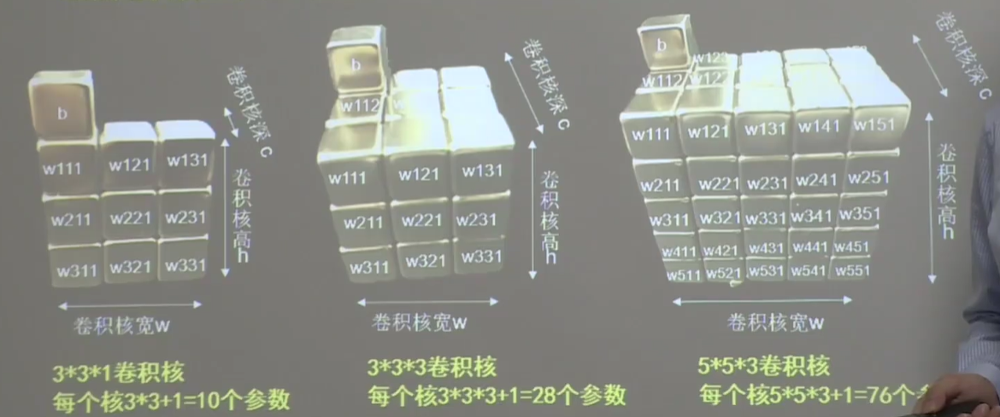
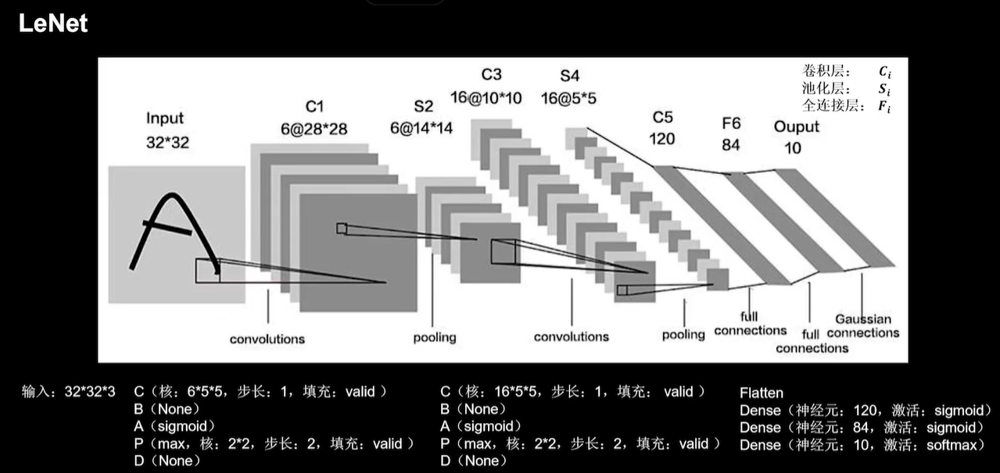
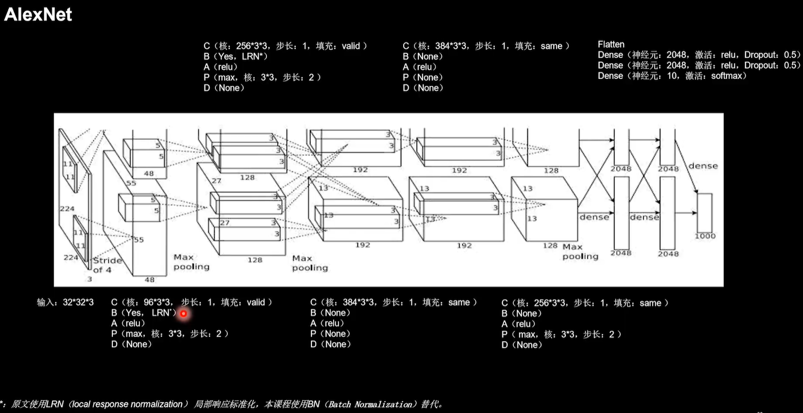

# 北京大学 Tensorflow2.0深度学习

# 第一章

## 1.1 人工智能三学派

三学派:

行为主义、符号主义、连接主义

## 1.2神经网络设计过程

梯度下降法：

沿损失函数梯度下降的方向，寻找函数的最小值，得到最优参数的方法。

权重w，偏置b，学习率l_r
$$
w_{t+1} = w_t - l_r*\frac{\partial loss}{\partial w_t}\\
b_{t+1} = b - l_r*\frac{\partial loss}{\partial b_t}\\
w_{t+1} * x + b_t+1 \rightarrow y\\
$$
损失函数：

预测值（y）与标准答案（y_）的差距。损失函数可以定量判断w、b的优劣，当损失函数输出最小时，参数w、b会出现最优值。

均方误差：
$$
MSE(y, y\_) = \frac{\sum_{k=0}^n(y-y\_)^2}{n}\\
$$

## 1.3 张量生成

### 数据类型;

* tf.int, tf.float

  tf.int32, tf.float32, tf.float64

* tf.bool

  tf.constant([True, False])

* tf.string

  tf.constant("Hello, World")

### 创建张量

* 一般形式

  tf.constant(张量内容, dtype=数据类型（可选）)

* 将numpy类型转换为张量

  tf.convert_to_tensor(数据名, dtype=数据类型（可选）)

* 创建全0张量

  tf.zeros(维度)

* 创建全1张量

  tf.ones(维度)

* 创建全为指定值的张量

  tf.fill(维度，指定值)

* 生成正态分布的随机数，默认均值为0，标准差为1

  tf.random.normal(维度， mean=均值， stddv=标准差)

* 生成截断式正态分布的随机数（分布在两倍标准差之间）

  tf.random.truncated_normal(维度， mean=均值， stddv=标准差)

  >在tf.random.truncated_normal中，如果随机数生成数据的取值在$(\mu-2\sigma, \mu+2\sigma)$之外则重新进行生成，保证了生成值在均值附近。
  >
  >$$\sigma = \sqrt{\frac{\sum_{i=1}^n(x_i-\overline x)}{n}}$$

* 生成均匀分布随机数 `[minval, maxval)`

  tf.random.uniform(维度， minval=最小值, maxval=最大值)

* 强制tensor转换为该数据类型

  tf.cast(张量名, dtype=数据类型)

* 计算张量维度上元素的最小值

  tf.reduce_min(张量名)

* 计算张量维度上元素的最大值

  tf.reduce_max(张量名)

## 1.4 TF2常用函数1

### 理解axis

>在一个二位张量或数组中，可以通过调整axis等于0或1控制执行维度
>
>axis=0代表跨行（经度，down），axis=1代表跨列（纬度，across）
>
>如果不指定，则所有元素参与运算

* 计算张量沿着指定维度的平均值

  tf.reduce_mean(张量名, axis=操作轴)

* 计算张量沿着指定维度的和

  tf.reduce_sum(张量名, axis=操作轴)

* 将变量标记为可训练

  > 被标记变量会在反向传播中记录梯度信息。神经网络训练中，常用该函数标记待训练参数

  tf.Variable(初始值)

  w = tf.Variable(tf.random.normal([2, 2], mean=0, stddv=1))

### 对应元素的运算

> 只有维度相同的张量才可以做四则运算

* 实现两个张量的对应元素相加

  tf.add(张量1, 张量2)

* 实现两个张量的对应元素相减

  tf.subtract(张量1, 张量2)

* 实现两个张量的对应元素相乘

  tf.multiply(张量1, 张量2)

* 实现两个张量的对应元素相除

  tf.divide(张量1, 张量2)

* 计算某个张量的平方

  tf.square(张量名)

* 计算某个张量的n次方

  tf.pow(张量名, n次方数)

* 计算某个张量的开方

  tf.sqrt(张量名)

* 实现两个矩阵相乘

  tf.matmul(矩阵1, 矩阵2)

* 切分传入张量的第一维度，生成输入特征/标签对，构建数据集

  data = tf.data.Dataset.from_tensor_slices(输入特征, 标签)

  > numpy和tensor格式都可以用该语句读入数据

## 1.5 TF2常用函数2

* 某个函数对指定参数的求导运算

  with tf.DradientTape() as tape:

  ​	w = tf.Variable(tf.canstant(3.0))

  ​	loss = tf.pow(w, 2)

  grad = tape.grandient(函数, 参数)

* 枚举元素enumerate

  enumerate(列表名)

  seq = ['one', 'two', 'three']

  for i, element in enumerate(seq):

  ​	print(i, element)

  > 运行结果：
  >
  > 0 one
  >
  > 1 two
  >
  > 2 three

* 独热码

  tf.one_hot(带转换数据, depth=几分类)

* 使输出符合概率分布

  tf.nn.softmax(x)

  $$Softmax(y_i) = \frac{e^{y_i}}{\sum^n_{j=0}e^y_i}$$

  > 当n分类的n个输出$(y_0, y_1, \dots y_n)$通过softmax函数便符合概率分布了
  >
  > $\forall P(X = x)\in [0, 1] 且 \sum\limits_{x}P(X = x) = 1$

* 赋值操作，更新参数的值并返回

  w.assign_sub(w要自减的内容)

  //自减操作 w = w-1

  w = tf.Variable(4)

  w.assign_sub(1)

  > 调用assign_sub前，先用tf.Variable定义变量w为可训练（可自更新）

* 返回张量沿指定维度最大的索引

  tf.argmax(张量名, axis=操作轴)

## 1.6 鸢尾花数据读入

```python
from sklearn import datasets
from pandas import DataFrame
import pandas as pd

x_data = datasets.load_iris().data
y_data = datasets.load_iris().target
# print("x_data from datasets: \n", x_data)
# print("y_data from datasets: \n", y_data)

x_data = DataFrame(x_data, columns=['花萼长度', '花萼宽度', '花瓣长度', '花瓣宽度',])
pd.set_option('display.unicode.east_asian_width', True)
print('x_data add index: \n', x_data)

x_data['类别'] = y_data
print('x_data add a column: \n', x_data)
```

## 1.7 神经网络实现鸢尾花分类

### 准备数据

* 数据集读入
* 数据集乱序
* 生成数据集和测试集（即x_train/y_train，x_test/y_test）
* 配成(输入特征, 标签)对，每次读入一小撮（batch）

### 搭建网络

* 定义神经网络中所有可训练数据

### 参数优化

* 嵌套循环迭代，with结构更新参数， 显示当前loss

### 测试效果

* 计算当前参数前向传播后的准确率，显示当前acc

### acc/loss可视化

# 第二章

## 2.1 预备知识

* 条件语句真返回A。条件语句假返回B

  tf.where(条件语句, 真返回A, 假返回B)

* 返回一个[0, 1)之间的随机数

  np.random.RandomState.rand(维度)

* 将两个数组按垂直方向叠加

  np.vstack(数组1, 数组2)

* 生成网格坐标点（ np.mgrid[], .ravel(), np.c_[] ）

  * 返回若干组维度相同的等差数组

    np.mgrid[起始值: 结束值: 步长, 起始值: 结束值: 步长, ……]，[起始值, 结束值)

  * 将x变为一维数组

    x.ravel()

  * 使返回的间隔数值点配对

    np.c_[数组1, 数组2, ……]

## 2.2 复杂度与学习率

### NN复杂度：多用NN层数和NN参数的个数表示

* 空间复杂度
  * 层数 = 隐藏层的层数 + 1个输出层
  * 总参数 = 总w + 总b
* 时间复杂度
  * 乘加运算次数

### 指数衰减学习率

$指数衰减学习率 = 初始学习率 * 学习率衰减率^{(当前轮数 / 多少轮衰减一次)}$

## 2.3 激活函数

* Sigmoid函数

  tf.nn.sigmoid(x)

  $f(x) = \frac{1}{1 + e^{-x}}$

  > 易造成梯度消失
  >
  > 输出非0均值，收敛慢
  >
  > 幂运算复杂，训练时间长

* Tanh函数

  tf.math.tanh(x)

  $f(x) = \frac{1 - e^{-2x}}{1 + e^{-2x}}$

  > 输出是0均值
  >
  > 易造成梯度消失
  >
  > 幂运算复杂，训练时间长

* Relu函数

  tf.nn.relu(x)

  $f(x) = max(x, 0)$

  > 优点：
  >
  > 解决了梯度消失问题
  >
  > 只需判断输入是否大于0，计算速度快
  >
  > 收敛速度远快于sigmoid和tanh

  > 缺点：
  >
  > 输出非0均值，收收敛慢
  >
  > DeadRelU问题：某些神经元可能永远不会被激活，导致相应的参数永远不可能被更新

* Leaky Relu函数

  tf.nn.leaky_relu(x)

  $f(x) = max(\alpha x, x)$

  > 理论上讲，Leaky Relu有Relu的所有优点，不会有Dead Relu问题，但实际操作中并没有完全证明Leaky Relu总是优于Relu

#### 建议

* 首选relu
* 学习率设置较小值
* 输入特征标准化，即满足0为均值，1为标准差的正态分布
* 初始参数中心化，即让随机生成的参数满足以0为均值，$\sqrt\frac{2}{当前层输入特征个数}$为标准差的正态分布

## 2.4 损失函数

* 损失函数（loss）：预测值（y）与已知答案（y_）的差距

  NN优化目标：loss最小

* 均方误差mes：

  loss_mse = tf.reduce_mean(tf.square(y - y_))

  $MSE(y, y_) = \frac{\sum_{i=1}^n (y - y\_)^2}{n}$ 

* 自定义损失函数
  $$
  loss(y, y\_) = \sum\limits_{n} f(y\_, y)\\
  f(y_, y) = \left\{\begin{aligned}&PROFIT * (y\_ - y)\quad y<y\_\\&COST * (y - y\_)\quad y \geq y\_\end{aligned}\right.
  $$
  
* 交叉熵损失函数CE（Corss Entropy）：表征两个概率分布之间的距离

  tf.losses.categorical_crossentropy(y_, y)

  $H(y\_, y) = - \sum y\_ * lny$

* softmax与交叉熵结合

  tf.nn.softmax_cross_entropywithlogits(y_, y)

  > 输出先过softmax函数，再计算y与y_的交叉熵损失函数

## 2.5 缓解过拟合

### 欠拟合与过拟合

* 欠拟合的解决方法

  增加输入特征项

  增加网络参数

  减少正则化参数

* 过拟合的解决方法

  数据清洗

  增大训练集

  采用正则化

  增大正则化参数

### 正则化缓解过拟合

正则化在损失函数中加入模型复杂度指标，利用给w加权重，弱化了训练数据的噪声（一般不正则化b）

loss = loss(y与y_) + REGULARIZER* loss(w)
$$
loss_{l1}(w) = \sum \vert w_i \vert\quad L1正则化\\
loss_{l2}(w) = \sum \vert w_i^2 \vert\quad L2正则化
$$
L1正则化：大概率会使很多参数变为0，因此该方法可通过稀疏参数，即减少参数的数量，降低复杂度

L2正则化：会使参数很接近0但不为0，因此该方法可通过减小参数值的大小降低复杂度，可以减小噪声引起的影响

## 2.6 优化器

### 神经网络参数优化器

待优化参数$w$，损失函数$loss$，学习率$lr$，每次迭代一个batch，$t$表示当前batch迭代总次数：

1.计算$t$时刻损失函数关于当前参数的梯度$g_t = \nabla loss = \frac{\partial loss}{\partial(w_t)}$

2.计算$t$时刻一阶动量$m_t$和二阶动量$V_t$

3.计算$t$时刻下降梯度：$\eta_t = l_r \cdot m_t/\sqrt{V_t}$

4.计算$t+1$时刻参数：$w_{t+1} = w_t - \eta_t = w_t - l_r \cdot m_t/\sqrt{V_t}$

> 一阶动量：与梯度相关的函数
>
> 二阶动量与梯度平方相关的函数

### 优化器

* SGD（无momentum），常用梯度下降法。
  $$
  \begin{align*}
  m_t &= g_t\quad\quad V_t = 1\\
  \eta_t &= l_r \cdot m_t/\sqrt{V_t} = l_r \cdot g_t\\
  w_{t+1} &= w_t - \eta_t\\
  &= w_t - l_r \cdot m_t/\sqrt{V_t} = w_t - l_r \cdot g_t
  \end{align*}
  $$
  
* SGDM（含momentum的SGD），在AGD基础上增加一阶动量
  $$
  \begin{align*}
  m_t &=\beta\cdot m_{t-1} + (1-\beta)\cdot g_t\quad V_t = 1\\
  \eta_t &= l_r \cdot m_t/\sqrt{V_t} = l_r \cdot m_t\\
  &=l_r\cdot(\beta\cdot m_{t-1} + (1-\beta)\cdot g_t)\\
  w_{t+1} &= w_t - \eta_t\\
  &= w_t - l_r \cdot (\beta\cdot m_{t-1} + (1-\beta)\cdot g_t)
  \end{align*}
  $$

* Adagrad，在SGD基础上增加二阶动量
  $$
  \begin{align*}
  m_t &= g_t\quad\quad V_t = \sum_{\tau=1}^tg_\tau^2\\
  \eta_t &= l_r\cdot m_t/(\sqrt{V_t}) = l_r\cdot g_t/(\sqrt{\sum_{\tau=1}^tg_\tau^2})\\
  w_{t+1} &= w_t - \eta_t\\
  &= w_t - l_r\cdot g_t/(\sqrt{\sum_{\tau=1}^tg_\tau^2})
  \end{align*}
  $$
  
* RMSProp，SGD基础上增加二阶动量
  $$
  \begin{align*}
  m_t &= g_t\quad\quad V_t = \beta\cdot V_{t-1} + (1 - \beta)\cdot g_t^2\\
  \eta_t &= l_r\cdot m_t / sqrt{V_t}\\
  &= l_r\cdot g_t/(\sqrt{\beta\cdot V_{t-1} + (1 - \beta)\cdot g_t^2})\\
  w_{t+1} &= w_t - \eta_t\\
  &= w_t - l_r\cdot g_t/(\sqrt{\beta\cdot V_{t-1} + (1 -1\beta)\cdot g_t^2})
  \end{align*}
  $$
  
* Adam，同时结合SGDM一阶动量和RMSProp二阶动量
  $$
  \begin{align*}
  m_t &= \beta_1\cdot m_{t-1} + (1-\beta_1)\cdot g_t\\
  修正&一阶动量的偏差：\widehat{m_t} = \frac{m_t}{1 - \beta_1^t}\\
  V_t &= \beta_2\cdot V_{step-1} + (1-\beta_2)\cdot g_t^2\\
  修正&二阶动量的偏差：\widehat{V_t} = \frac{V_t}{1 - \beta_2^t}\\
  \eta_t &= l_r\cdot \widehat{m_t}/\sqrt{\widehat{V_t}}\\
  &= l_r\cdot \frac{m_t}{1 - \beta_1^t} / \sqrt{\frac{V_t}{1 - \beta_2^t}}\\
  w_{t+1} &= w_t - \eta_t\\
  &= w_t - l_r\cdot \frac{m_t}{1 - \beta_1^t} / \sqrt{\frac{V_t}{1 - \beta_2^t}}
  \end{align*}
  $$
  

# 第三章

* 神经网络搭建八股
* iris代码复现
* MNIST数据集
* Fashion数据集

## 3.1 使用八股搭建神经网络

用Tensorflow API：tf.keras搭建网络八股

六步法：

* import

* train, test

* model = tf.keras.models.Sequential([网络结构])    #描述各层网络

  网络结构举例：

  * 拉直层：

    tf.keras.layers.Flatten()

  * 全连接层：

    tf.keras.layers.Dense(神经元个数, activation="激活函数", lernel_regularizer=正则化方法)

    在整个卷积神经网络中起到“分类器”的作用

  * 卷积层：

    tf.keras.layer.Conv2D(filters=卷积核个数, kernel_size=卷积核尺寸, strides=卷积步长, padding="vaild"或"same")

  * LSTM层：tf.keras.layers.LSTM()

* model.compile(optimizer=优化器, loss=损失函数, metrics=["准确率"])

  * Optimizer可选：

    'sgd' or tf.keras.optimizers.SGD(lr=学习率, momentum=动量参数)

    'adagrad' or tf.keras.optimizers.Adagrad(lr=学习率)

    'adadelta' or tf.keras.optimizers.Adadelta(lr=学习率)

    'adam' or tf.keras.optimizers.Adam(lr=学习率, beta_1=0.9, beta_2=0.999)

  * loss可选：

    'mse' or tf.keras.losses.MeanSquaredError()

    'sparse_categorical_crossentropy' or tf.keras.losses.SparseCategoricalCrossentropy(from_logits=False)

  * Metrics可选：

    'accuracy'：y\_和y都是数值，如y\_ = [1] y = [1]

    'categorical_accuracy'：y\_和y都是独热码（概率分布）

    'sparse_categorical_accuracy'：y_是数值，y是独热码（概率分布）

* model.fit

  ```pytohn
  model.fit(
  	训练集的输入特征, 
  	训练集的标签, 
  	batch_size= , 
  	epoch= ,
  	validation_data=(测试集的输入特征, 测试集的标签), 
  	validation_freq = 多少次epoch测试一次
  )
  ```

* model.summary

## 3.2 搭建网络八股class

用Tensorflow API：tf.keras搭建网络八股

六步法：

* import

* train, test

* class MyModel(Model) model = MyModel

  ```python
  class MoModel(Model):
    def__init__(self):
      super(MyModel, self).__init__()
      定义网络模块
    def call(self, x):
      调用网络结构块，实现前向传播
      return y
  ```

  

* model.compile(optimizer=优化器, loss=损失函数, metrics=["准确率"])

* model.fit

* model.summary

## 3.3 MNIST数据集


## 3.4 FASHION数据集


# 第四章

## 4.1 搭建网络八股总览

### 六步法

* import

* train
* Sequential/Class
* model.complie
* model.fit
* model.summary

### 神经网络八股功能拓展

1.自制数据集,解决本领域应用

2.数据增强,扩充数据集

3.断点续训,存取模型

4.参数提取,把参数存入文本

5.acc/loss可视化,查看训练效果

6.应用程序,给图识物

## 4.2 自制数据集


## 4.3 数据增强

```python
image_gen_train = tf.keras.preprocessing.image.ImageDataGenerator(
  rescale = 所有数据乘以该数值, 
  rotation_range = 随机旋转角度, 
  width_shift_range = 随机宽度偏转量, 
  height_shift_range = 随机高度偏转量, 
  水平翻转：horziontal_flip = 是否随机水平翻转, 
  随机缩放：zoom_range = 随机缩放范围[1-n, 1+n]
)
```

## 4.4 断点续训

保存模型：

```python
tf.keras.callbacks.ModelCheckpoint(
  filepath=路径文件名,
  save_weights_only=True/False,
  save_best_only=True/False
)
```

## 4.5 参数提取

```python
print(model.trainable_varables)
file = open('./weights.txt', 'w')
for v in model.trainable_variables:
	file.write(str(v.name) + '\n'), 
	file.write(str(v.shape) + '\n'), 
	file.write(str(v.numpy()) + '\n')
file.close()
```

## 4.6 acc/loss可视化


## 4.7 给图识物

### 前向传播执行应用

```python
//复现模型（前向传播）
model = tf.keras.models.Sequential([
  tf.keras.layers.Flatten(), 
  tf.keras.layers.Dense(128, activation='relu'), 
  tf.keras.layers.Dense(10, activation='softmax')
])
//加载参数
model.load_weights(model_save_path)
//预测结果
result = model.predict(x_predict)
```

# 第五章

## 5.1 卷积计算过程

* 全连接NN

  每个神经元与前后相邻层的每一个神经元都有全连接关系，输入是特征，输出为预测结果。

  参数个数：$\sum\limits_{各层}(前层\times 后层 + 后层)$

* 卷积核

  输入特征图的深度（channel数），决定了当前卷积核的深度；

  当前卷积核的个数，决定了当前层输出特征图的深度。

  

## 5.2 感受野（Receptive Field）

卷积神经网络各输出特征图中的每个像素点，在原始输入图片上映射区域的大小。

当x>10时，两层3\*3卷积核优于一层5\*5卷积核

## 5.3 全零填充（padding）

$$
padding\left\{\begin{aligned}
&SAME（全零填充） \quad\quad\quad\quad\quad\frac{入长}{步长}&（向上取整）\\
&VALID（不全零填充）\quad\frac{入长-核长+1}{步长}&（向上取整）
\end{aligned}\right.
$$

## 5.4 TF描述卷积计算层

```python
tf.keras.layers.Conv2D(
	filters=卷积核个数, 
  kernel_size=卷积核尺寸, 	# 正方形写核长整数，或（核高h，核宽w）
  strides=滑动步长, 	# 横纵向相同写步长整数，或（纵向步长h，横向步长w），默认1，用元组表示
  padding="same" or "valid", 	# 使用全零填充是"same"，不使用全零填充是"valid"（默认）
  actication="relu" or "sigmoid" or "tanh" or "softmax"等, 	# 如有BN此处不写
  input_shape=（高，宽，通道数） 	#输入特征维度，可省略
)
```

## 5.5 批标准化（Batch Normalization， BN）

对一小批数据（batch），做标准化处理。
$$
\begin{align*}
H'^k_i &= \frac{H^k_i - \mu^k_{batch}}{\sigma^k_{batch}}\\
\mu^k_{batch} &= \sqrt{\frac{1}{m} \sum_{i=1}^{m}(H^k_i - \mu^k_{batch})^2}
\end{align*}
$$


为每个卷积核引入可训练参数$\gamma$（缩放因子）和$\beta$（偏移因子），调整批归一化的力度
$$
X^k_i = \gamma_kH'^k_i + \beta_k
$$

* BN层位于卷积层之后，激活层之前。
  $$
  卷积\rightarrow批标准化\rightarrow激活
  $$
  
* TF描述标准化

  ```python
  tf.keras.layers.BatchNormalization()
  ```

## 5.6 池化（pooling）

池化用于减少特征数据量。

最大值池化可提取图片纹理，均值池化可保留背景特征。

```python
tf.keras.layers.MaxPool2D(
	pool_size=池化核尺寸, 	# 正方形写核长整数，或元组
  strides=池化步长, 	# 步长整数，或（纵向步长h，横向步长w），默认为pool_size
  padding='valid' or 'same'
)

tf.keras.layers.AveragePool2D(
	pool_size=池化核尺寸, 	# 正方形写核长整数， 或元组
  strides=池化步长, 	# 步长整数，或（纵向步长h，横向步长w），默认为pool_size
  padding='valid' or 'same'
)
```

## 5.7 舍弃（dropout）

在神经网络训练时，将一部分神经元按照一定概率从神经网络中暂时舍弃。神经网络使用时，被舍弃的神经元恢复链接。

* TF描述池化

  tf.keras.layersDropout(舍弃的概率)

## 5.8 卷积神经网络

卷积神经网络：借助卷积核提取特征后，送入全连接网络。

卷积神经网络的主要模块：
$$
\underset{卷积}{Convolutional}\rightarrow \underset{批标准化}{BN}\rightarrow \underset{激活}{Activation}\rightarrow \underset{池化}{pooling}\rightarrow \underset{舍弃}{Dropout}\rightarrow \underset{全连接}{FC}
$$

```python
model = tf.keras.models.Sequential([
  Conv2D(filters=6, kernel_size=(5, 5), pading='same'),		# 卷积层
  BatchNormalization(), 	# BN层
  Activation('relu'), 	# 激活层
  MaxPool2D(pool_size=(2, 2), strides=2, padding='same'), 	# 池化
  Dropout(0.2) 	# dropout层
])
```

## 5.9 CIFAR10数据集


## 5.10 卷积神经网络搭建示例

* C

  核：6\*5\*5，步长：1，填充：same

* B

  Yes

* A

  relu

* P

  max，核2\*2，步长：2，填充：same

* D

  0.2

* Flatten

  Dense(神经元：128, 激活：relu, Dropout：0.2)

  Dense(神经元：10, 激活：softmax)

## 5.11 LeNet

经典卷积网络：
$$
\underset{1998}{LeNet}\rightarrow\underset{2012}{AlexNet}\rightarrow\underset{2014}{VGGNet}\rightarrow\underset{2014}{InceptionNet}\rightarrow\underset{2015}{ResNet}
$$

* LeNet网络结构

  

  https://blog.csdn.net/u012897374/article/details/78575594

  每个卷积核具有长、宽、深三个维度。在CNN的一个卷积层中：

  * 卷积核的长、宽都是人为指定的，长X宽也被称为卷积核的尺寸，常用的尺寸为3X3，5X5等；
  * 卷积核的深度与当前图像的深度（feather map的张数）相同，所以指定卷积核时，只需指定其长和宽 两个参数。例如，在原始图像层 （输入层），如果图像是灰度图像，其feather map数量为1，则卷积核的深度也就是1；如果图像是grb图像，其feather map数量为3，则卷积核的深度也就是3.
    ————————————————
    原文链接：https://blog.csdn.net/xys430381_1/article/details/82529397

## 5.12 AlexNet



https://blog.csdn.net/Rasin_Wu/article/details/80017920