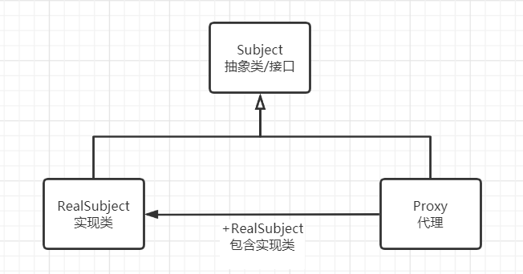

# Spring随笔

## Spring的七个模块

- Spring Context：提供框架式的Bean访问方式，以及企业级功能（JNDI、定时任务等）；Spring Core：核心类库，所有功能都依赖于该类库，提供IOC和DI服务；
- Spring AOP：AOP服务；
- Spring Web：提供了基本的面向Web的综合特性，提供对常见框架如Struts2的支持，Spring能够管理这些框架，将Spring的资源注入给框架，也能在这些框架的前后插入拦截器；
- Spring MVC：提供面向Web应用的Model-View-Controller，即MVC实现。
- Spring DAO：对JDBC的抽象封装，简化了数据访问异常的处理，并能统一管理JDBC事务；
- Spring ORM：对现有的ORM框架的支持；

[Spring常见面试题总结（超详细回答）](https://blog.csdn.net/a745233700/article/details/80959716)

## @Configuration

## Spring的IoC理解

### 什么是IoC

Inversion of Control，控制反转，指将对象的控制权转移给Spring框架，由 Spring 来负责控制对象的生命周期（比如创建、销毁）和对象间的依赖关系。不需要使用new指令来创建依赖对象，减少耦合。对于某个具体的对象而言，以前是由自己控制它所引用对象的生命周期，而在IOC中，所有的对象都被 Spring 控制，控制对象生命周期的不再是引用它的对象，而是Spring容器，由 Spring 容器帮我们创建、查找及注入依赖对象，而引用对象只是被动的接受依赖对象，所以这叫控制反转。

### 什么是DI

Dependency Injection，依赖注入，应用程序在运行时依赖 IoC 容器来动态注入对象所需要的外部依赖。而 Spring 的 DI 具体就是通过**反射**实现注入的，反射允许程序在运行的时候动态的生成对象、执行对象的方法、改变对象的属性。

### IoC的原理

Spring 的 IoC 的实现原理就是工厂模式加反射机制，而在 Spring 容器中，Bean 对象如何注册到 IoC 容器，以及Bean对象的加载、实例化、初始化详细过程可以阅读这篇文章：[Spring的Bean加载流程_张维鹏的博客-CSDN博客](https://blog.csdn.net/a745233700/article/details/113840727 "Spring的Bean加载流程_张维鹏的博客-CSDN博客")

#### Bean的加载流程

##### 容器启动阶段

###### 1.配置元信息

元信息即为Spring创建一个对象所需要的必要信息。这些信息可以是Spring过去支持的xml文件，或者是其他形式的例如properties的磁盘文件也可以是现在主流的注解，甚至是直接的代码硬编码。总之，这些创建对象所需要的必要信息称为元信息。

###### 2.BeanDefination

Spring在内存中表示这些配置元信息的方式就是BeanDefination，这里我们不会去分析BeanDefination的代码，*只需要知道配置元信息被加载到内存之后是以BeanDefination的形存在的即可。*

###### 3.BeanDefinationRegistry

Spring通过BeanDefinationReader将配置元信息加载到内存生成相应的BeanDefination之后，就将其注册到BeanDefinationRegistry中，它是一种键值对的像是，通过特定的Bean

定义的id，映射到相应的BeanDefination。

###### 4.BeanFactoryPostPreocessor

BeanFactoryPostProcessor是容器启动阶段Spring提供的一个扩展点，主要负责对注册到BeanDefinationRegistry中的一个个的BeanDefination进行一定程度上的修改与替换。例如我们的配置元信息中有些可能会修改的配置信息散落到各处，不够灵活，修改相应配置的时候比较麻烦，这时我们可以使用占位符的方式来配置。例如配置Jdbc的DataSource连接的时候可以这样配置：

```xml
<bean id="dataSource"  
    class="org.apache.commons.dbcp.BasicDataSource"  
    destroy-method="close">  
    <property name="maxIdle" value="${jdbc.maxIdle}"></property>  
    <property name="maxActive" value="${jdbc.maxActive}"></property>  
    <property name="maxWait" value="${jdbc.maxWait}"></property>  
    <property name="minIdle" value="${jdbc.minIdle}"></property>  
  
    <property name="driverClassName"  
        value="${jdbc.driverClassName}">  
    </property>  
    <property name="url" value="${jdbc.url}"></property>  
  
    <property name="username" value="${jdbc.username}"></property>  
    <property name="password" value="${jdbc.password}"></property>  
</bean>
```

BeanFactoryPostProcessor会对注册到BeanDefinationRegistry中的BeanDefination做最后的修改，替换 `$`占位符为配置文件中的真实数据。

## Spring的AOP理解

AOP，一般称为面向切面，作为面向对象的一种补充，**用于将那些与业务无关，但却对多个对象产生影响的公共行为和逻辑，抽取并封装为一个可重用的模块**，这个模块被命名为“切面”（Aspect），减少系统中的重复代码，降低了模块间的耦合度，提高系统的可维护性。可用于权限认证、日志、事务处理。

### [代理模式](https://www.cnblogs.com/qiyuanc/p/Spring_Proxy.html)

#### 静态代理

**定义：为其他对象提供一种代理以控制对这个对象的访问。**



- Subject抽象角色：抽象主题类可以是抽象类也可以是接口，是一个最普通的业务类型定义；
- RealSubjest具体角色：也叫做被委托角色、被代理角色，是业务逻辑的具体执行者；
- Proxy代理角色：也叫做委托类、代理类。它负责对真是角色的应用，把所有抽象主题类定义的方法限制委托给真实主题角色实现，并且在真实主题角色处理完毕后做预处理和善后工作。

#### 动态代理
