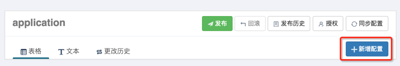
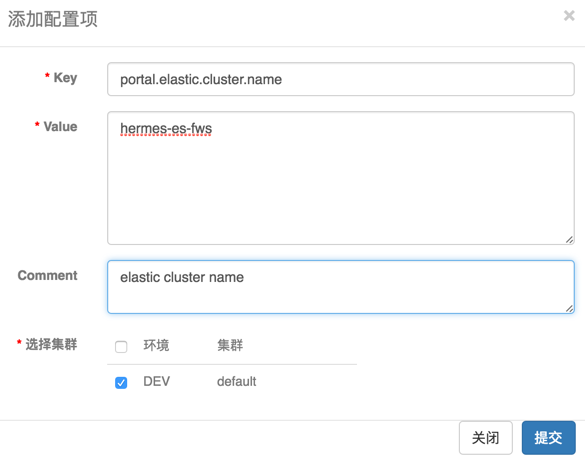
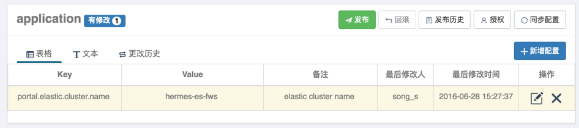
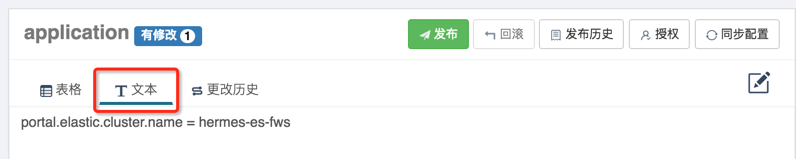

# 创建项目

1. 打开apollo-protal主页
2. 点击创建项目
3. 输入项目信息
   - 部门
   - AppId：用来标识应用唯一身份id，格式为String，需要和客户端app.properties中配置的app.id对应
   - 应用名称：仅用于界面展示
   - 应用负责人：选择的人默认会成为该项目的管理员，具备项目管理权限，集群创建、Namespace创建等权限
4. 点击提交，会自动跳转到首页

## 添加配置项

1. 点击新增配置



2. 添加配置项



3. 点击提交



4. 也可以通过文本模式编辑



只支持properties文件，yml文件可以通过[在线转换工具](https://www.toyaml.com/index.html)转化后导入

# 客户端使用指南

## 客户端用法

### Maven依赖

```xml
    <dependency>
      <groupId>com.ctrip.framework.apollo</groupId>
      <artifactId>apollo-client</artifactId>
      <version>1.9.2</version>
    </dependency>
```

### API使用方式

#### 获取默认namespace的配置（application）

```java
Config config = ConfigService.getAppConfig(); //config instance is singleton for each namespace and is never null
String someKey = "someKeyFromDefaultNamespace";
String someDefaultValue = "someDefaultValueForTheKey";
String value = config.getProperty(someKey, someDefaultValue);
```

配置值从内存中获取，不需要应用自己做缓存。

#### 监听配置变化事件

监听配置变化事件只在应用真的关心配置变化，需要在配置变化时得到通知时使用，比如：数据库连接串变化后需要重建连接等。

如果只是希望每次都取到最新的配置的话，只需要按照上面的例子，调用**config.getProperty**即可。

```java
Config config = ConfigService.getAppConfig(); //config instance is singleton for each namespace and is never null
config.addChangeListener(new ConfigChangeListener() {
    @Override
    public void onChange(ConfigChangeEvent changeEvent) {
        System.out.println("Changes for namespace " + changeEvent.getNamespace());
        for (String key : changeEvent.changedKeys()) {
            ConfigChange change = changeEvent.getChange(key);
            System.out.println(String.format("Found change - key: %s, oldValue: %s, newValue: %s, changeType: %s", change.getPropertyName(), change.getOldValue(), change.getNewValue(), change.getChangeType()));
        }
    }
});
```

#### 获取非properties格式的namespace

##### yaml/yml格式

```java
Config config = ConfigService.getConfig("application.yml");
String someKey = "someKeyFromYmlNamespace";
String someDefaultValue = "someDefaultValueForTheKey";
String value = config.getProperty(someKey, someDefaultValue);
```

##### 非yaml/yml格式

获取时需要使用 `ConfigService.getConfigFile`接口并指定Format，如ConfigFileFormat.XML

```java
String someNamespace = "test";
ConfigFile configFile = ConfigService.getConfigFile("test", ConfigFileFormat.XML);
String content = configFile.getContent();
```

## SpringBoot集成方式

### 注入namespace配置

在application.yml中配置AppId，Apollo Meta Server，还有缓存路径：

```yml
apollo:
  meta: http://127.0.0.1:8080
#  cache-dir: /data/apollo-cache/
  bootstrap:
    enabled: true
    namespaces: lab-application.yml
app:
  id: tanka_lab
```

如果无法获取到Meta Server地址，Apollo最终会fallback到 `http://apollo.meta`作为Meta Server地址

Apollo客户端会把从服务端获取到的配置在本地文件系统缓存一份，用于在遇到服务不可用，或网络不通的时候，依然能从本地恢复配置，不影响应用正常运行。

本地缓存默认路劲为 `/opt/data/{appId}/config-cache`，配置文件中指定 `apollo.cache-dir`来自定义缓存路径

`bootstrap.namespaces`表明该项目会加载Meta Server中的lab-application.yml，`boostrap.enabled=true`表明在此之前application.properties会被默认加载

### 将Apollo配置加载提到初始化日志系统之前

从1.2.0版本开始，如果希望把日志相关的配置（如 `logging.level.root=info`或 `logback-spring.xml`中的参数）也放在Apollo管理，那么可以额外配置 `apollo.bootstrap.eagerLoad.enabled=true`来使Apollo的加载顺序放到日志系统加载之前，更多信息可以参考[PR 1614](https://github.com/apolloconfig/apollo/pull/1614)。参考配置示例如下：

```yml
# will inject 'application' namespace in bootstrap phase
apollo:
  bootstrap:
    enabled: true
# put apollo initialization before logging system initialization
  eagerLoad:
    enabled: true
```
