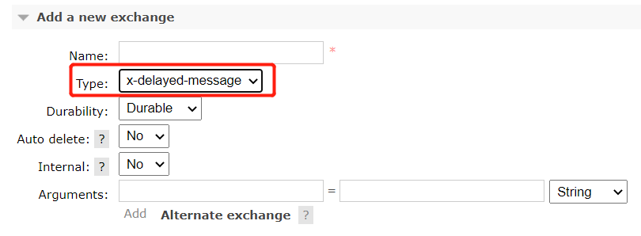

# RabbitMq延迟消息插件

# 插件配置

GitHub地址 `https://github.com/rabbitmq/rabbitmq-delayed-message-exchange`

下载对应版本的插件到rabbitmq插件目录，我的rabbitmq版本为3.10.5，下载对应版本[插件](https://github.com/rabbitmq/rabbitmq-delayed-message-exchange/releases/download/3.10.0/rabbitmq_delayed_message_exchange-3.10.0.ez)，到/usr/lib/rabbitmq/lib/rabbitmq_server-3.10.5/plugins下，执行命令：

```
rabbitmq-plugins enable rabbitmq_delayed_message_exchange
```

网上教程还说需要重启rabbitmq服务，但我貌似没有重启就生效了。。。

登录管理页面,在 `Add a new exchange`下出现 `x-delay-message`类型，说明配置成功！



## 代码实现

队列配置：

```java
@Configuration
public class DelayedQueueConfig {

  @Bean
  public CustomExchange delayedExchange() {
    Map<String, Object> args = new HashMap<>();
    args.put("x-delayed-type", "direct");
    //配置交换机类型
    return new CustomExchange(MqConstant.ExchangeName.DELAYED_EXCHANGE, "x-delayed-message", true, false, args);
  }

  //声明队列
  @Bean
  public Queue expiredWaitUserQueue() {
    Map<String, Object> args = Maps.newHashMap();
    args.put("x-queue-mode", "lazy");
    return QueueBuilder.durable(MqConstant.QueueName.EXPIRED_WAIT_QUEUE).withArguments(args).build();
  }

  //将队列和路由器与交换机绑定
  @Bean
  public Binding callExpiredWaitUserBinding() {
    return BindingBuilder.bind(expiredWaitUserQueue()).to(delayedExchange()).with(MqConstant.QueueName.EXPIRED_WAIT_QUEUE_KEY).noargs();
  }

}
```

发送消息：

```java
@RestController()
@RequestMapping("/init/test")
@Slf4j
public class Test {

  @Autowired
  private RabbitTemplate rabbitTemplate;

  @GetMapping("/queue/delay")
  public BaseResponse delayedQueue(@RequestParam Integer delay) {
    long now = System.currentTimeMillis();
    this.rabbitTemplate.convertAndSend(MqConstant.ExchangeName.DELAYED_EXCHANGE, MqConstant.QueueName.EXPIRED_WAIT_QUEUE_KEY, now, message -> {
      message.getMessageProperties().setDeliveryMode(MessageDeliveryMode.PERSISTENT);
      //设置延迟时间单位为毫秒
      message.getMessageProperties().setDelay(delay);
      return message;
    });
    return ReturnUtil.success();
  }
}
```

接收消息：

```java
@Component
@Slf4j
public class DelayedQueueConsumer {

  @RabbitListener(queues = MqConstant.QueueName.CALL_EXPIRED_WAIT_QUEUE)
  @RabbitHandler
  public void delayedQueueHandler(Long message) {
    long now = System.currentTimeMillis();
    log.debug("delayMsg-queue:{}, delay:{}",MqConstant.QueueName.EXPIRED_WAIT_QUEUE, now - message);
  }

}
```

日志打印：

```java
DEBUG 30980 --- [http-nio-10010-exec-1] ...LogAspectController : [LogAspect]-request-debug-url:http://localhost:10010/init/test/queue/delay
DEBUG 30980 --- [http-nio-10010-exec-1] ...LogAspectController : [LogAspect]-res-cost:22ms
DEBUG 30980 --- [org.springframework.amqp.rabbit.RabbitListenerEndpointContainer#0-1] ...DelayedQueueConsumer : delayMsg-queue:expired.wait.queue, delay:4998
```

我这里接口传入delay为5000，也就是5秒，但是从消息接收时间差来看却会快一点，考虑到网络开销也会有延迟，估计消息会提前更多。具体缘由还没搞清楚，不过可能和插件的timer使用的是Erlang语言的计时器有关？

## 一些特点与利弊分析（Github的[REDAME](https://github.com/rabbitmq/rabbitmq-delayed-message-exchange)总结）

插件支持的最长延迟：(2^32)-1 milliseconds。

如果发送消息时不设置delay，消息会以无延迟形式发送，这意味着该延迟交换机也可当作普通交换机来使用，但是出于性能和消息的时效性，不建议这样使用。

延迟的消息存储在当前节点上的一个单一磁盘副本的Mnesia表中，消息是持久化的，但是计时器会在服务或插件重启时重置，所以节点的失效与重启会丢失所有延迟消息。

不支持RAM节点，短期内也不会支持（无优先级）。

延迟消息只会推送一次，也就是说如果跟没有队列接收消息就会丢失？（猜测是这个意思）。

数据量太大的话表现很差，具体可以看[issue#72](https://github.com/rabbitmq/rabbitmq-delayed-message-exchange/issues/72)。

可以通过命令 `rabbitmq-plugins disable rabbitmq_delayed_message_exchange`来禁用插件，但是所有未被处理的消息将会丢失。

**总之**这个插件还有待开发，适用于数据量不大、重要性不高的业务。
