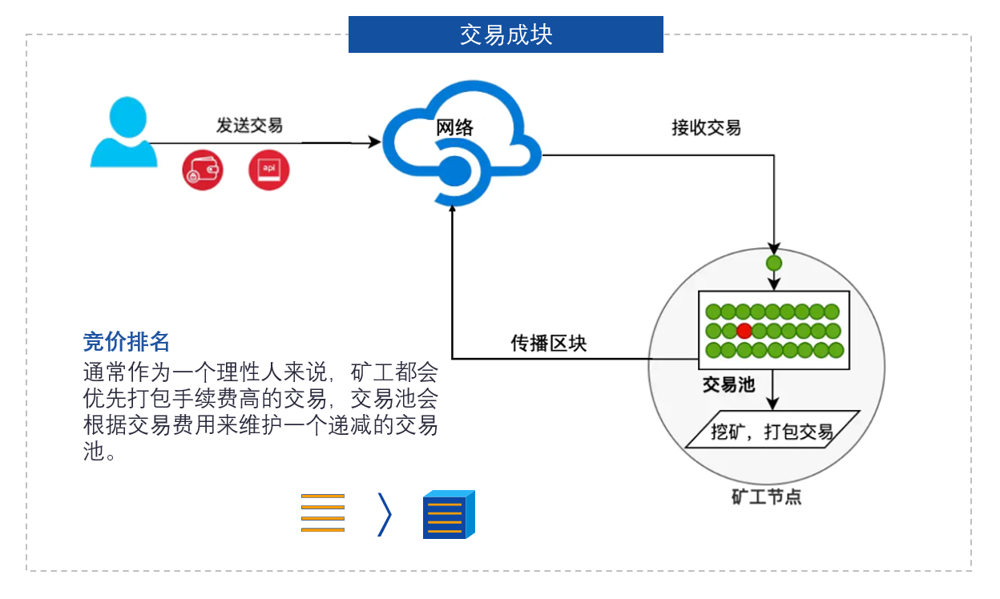
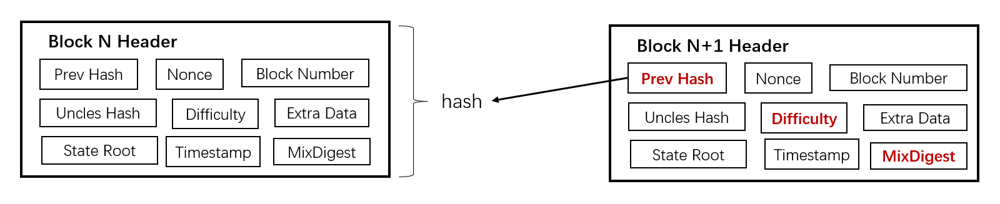
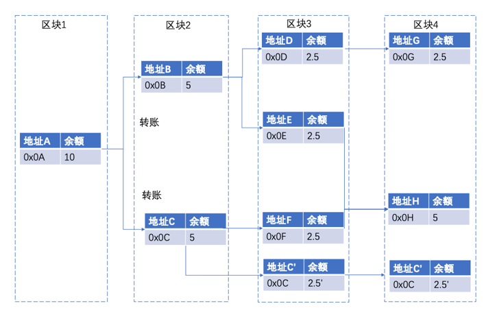
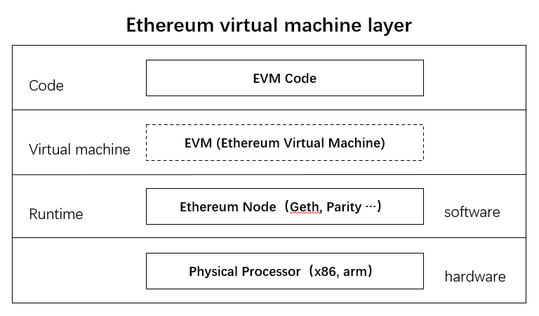
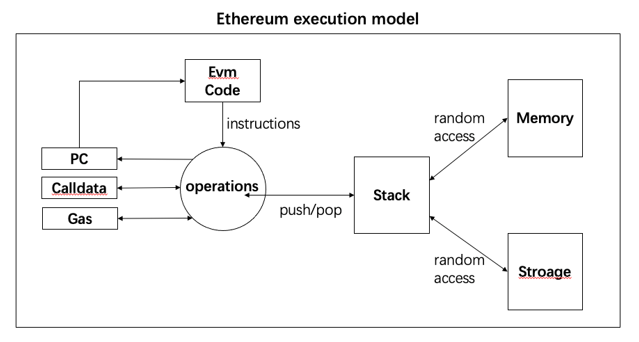
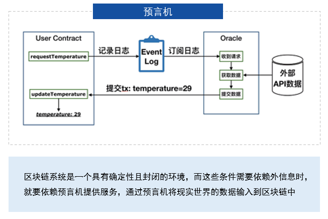
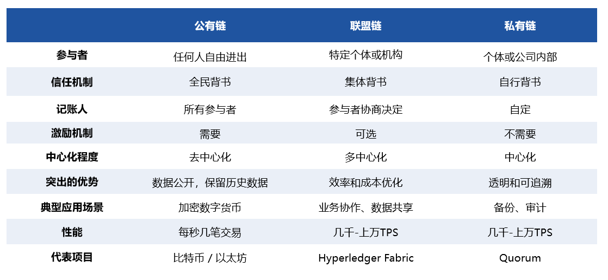
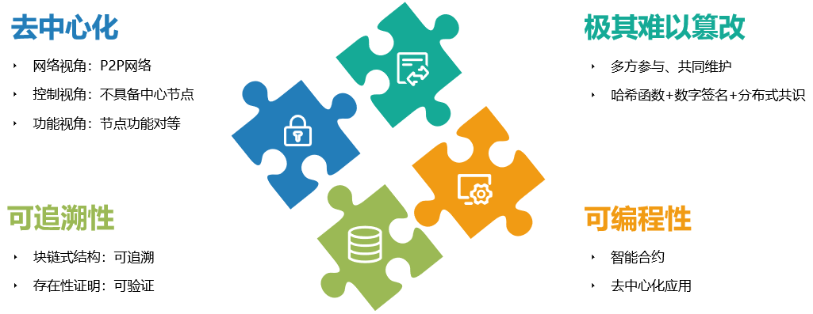

# 区块链技术初探

## 区块链系统概念

- 交易：指对一次账本的操作，如一笔转账。
- 区块：将一段时间内发生的所有交易和状态打包称为一个区块。
- 块链式数据结构：狭义区块链，区块以时间顺序前后相连，组成一种块链式数据结构，即区块链一词的由来。
- 分布式账本：广义区块链，多方参与各自部署，互联互通，构成分布式网络。

## 交易广播

## 区块串联

第n个区块是公开的，任何人都可以计算出它的哈希值。矿工生成下一个区块指向它，并且声明自己产生了新区块，以此来获得出块奖励。

争夺记账权：为了确定记账权引入了Difficulty（难度）和MixDigest（答案）。

使用规定哈希值前的0的个数来控制出块难度，即0越多难度约大。

## 区块链交易确认

交易哈希：

- 区块链是异步系统，交易发送者不知道交易何时才能上链
- 通过交易哈希来进行查询交易是否已经被打包进区块

等待确认：

- 在比特币中，当一个区块产生以后，因为可能会有分叉产生，所以它所包含的交易并不会被交易的接收房所信任。
- 区块链网络上的节点总是相信最长链上的区块。
- 其中一个区块中包含的交易可能会被回滚。
- 如果矿工继续在分叉挖矿，那么算力的对比会越来越悬殊，最为理性的做法就是尽快放弃。

## [UTXO模型](https://www.cnblogs.com/hhzm/p/14987047.html)

- UTXO模型：UTXO（Unspent Transaction Output）未花费交易输出
- 找零：地址C'就是一个找零地址，地址的余额超过了花费。
- 凑整：当地址的余额不支持花费的时候，需要将多个地址的余额凑到一起来花费。

## 区块广播[Gossip协议](https://zhuanlan.zhihu.com/p/162970961)

- 节点周期性的选择相邻的K个节点，并且向这K个节点发送自身存储的信息。
- K个节点接收到A发送过来的数据后，发现自身没有相同的数据则存储下来，如果有则丢掉，并且重复节点A的行为。

## 阶段历程

- 区块链1.0：数字货币，以数字货币的支付和转账为主要应用场景。
- 区块链2.0：世界计算机，只能合约为区块链代买可编程性，使复杂业务可落地。

## 以太坊

### 账户模型&智能合约

账户模型类似传统的银行账户，无论如何转账账户地址都是保持不变的，除了注销账户重新开户。以太坊采用账户模型主要是为了支持智能合约，对于智能合约来说需要一个相对稳定的身份。当我们签署一份合同，希望双方的省份明确，权责清晰。智能合约是一段部署在区块链上可自动运行的程序，可以自动化地执行预先定义好的规则和条款，通过减少人为干预的风险，提升交易执行的安全与可信程度。

### EVM

EVM设计目标：

- 简单性，操作码尽可能少切低级，数据类型尽可能少，虚拟机的结构尽可能简单。
- 确定性，EVM虚拟机的语句没有产生歧义的空间，在不同机器上的执行结果是确定一致的。
- 节约空间，EVM的组件尽可能的紧凑。
- 区块链定制化，合约必须可以处理20Byte的账户地址，自定义32Byte的密码学算法操作等。
- 安全模型简单安全，Gas的计价模型应该是简单一行且准确的。
- 便于优化，以便即时编译（JIT）和EVM的性能优化。

### 停机问题

停机问题就是判断一个程序是否能在有限的时间之内结束运行的问题。图灵在1936年就已经证明，不存在停机问题的通用解法。

**工程解决：** 引入了Gas来衡量一个操作或一组动作所需计算量。每笔交易设置他们愿意在Gas上的花费上限。以此来避免DDOS和垃圾交易。

### 预言机

流程：

1. 通过智能合约触发的事件，写入到产生的日志中。
2. 链下我们会启动一个进程，监听并订阅这个时间产生的日志。
3. 当这个进程监听到智能合约需要获得的莫格城市气温时间所产生的日志时，将指定城市的温度，通过发送交易的方式，调用合约中的回填方法，提交到智能合约中。

## 区块链分类与对比

- 联盟链：仅限于联盟成员参与，系统交易取人节点为事先预定，通过共识机制确认
- 共有链：全球范围可以访问，不依赖于单个公司或辖区，匿名性强，任何参与者都可以在中写入、读取、参与交易验证。
- 私有链：尽在机构内使用，读写权，记账权由组织内自由定制。中心控制者制定可参与和进行交易验证成员范围。

## 区块链特点

