# 区块链技术概述

## 比特币

### 数字货币

非常重要的一个属性是难以伪造（双重支付）。

- 如何防止双重支付：
  - 需要统一账本记录支付情况
- 方案0：中央机构发行IOU并维护一个账本，支付宝
- 方案1：中央机构发行IOU并维护一个匿名账本->e-cash【】（1982），PayPal
- 方案2：所有节点共同维护一个统一账本->比特币（2008）
  - 问题：统一账本的一致性->拜占庭容错问题【】（BFT）共识算法，即比特币PoW

### PoW原理

工作证明（Proof-of-Work）：即哈希值开头的m位为0

中本聪共识（最长链共识）简述

- 将时间以10分钟为单位分成若干轮
- 每轮随机选一个节点出块
- 诚实的节点将自己的区块链出现在他们观察到的最长链之后

问题：

如何在一个去中心、无许可、非同步的网络里实现这个机制：PoW

- 时钟同步
  - 算力是缓慢增长
  - “轮”——每个新块出现就进入下一轮
- 去中心的身份证明
  - 如何在互联网上去中心的验证身份：算力无法伪造->算力即身份->算力即权力
- 公平的随机方案
  - 如何用不可预测、无偏向、公平的随机方案找到新的出块者：因为哈希函数是安全的，所以“算哈希”这件事情是公平的
- 如何保证节点诚实
  - 挖矿奖励：成功算出结果的人会获得奖励
  - 最长链共识：只有在最长链上的区块才会得到奖励
  - 只有诚实才能将自己的利益最大化，恶意行为实际上是有代价的。

### 遗产

1. 加密货币
2. 共识算法领域
   1. 扩容问题：7tx/s，比特币性能低的原因是算法问题——目前主流算法都不能在降低去中心和安全性的前提下达到100-1000tps。比特币的性能问题完全是历史遗留问题
   2. 能耗问题：全世界0.43%，相当于荷兰的用电量。
3. 通用区块链->以太坊

## 公链

### 以太坊

基于区块链技术的虚拟货币->基于区块链技术的世界计算机

- 全世界共同维护一个账本->全世界共同维护一个计算机，所有计算结果都一致
- 一致的结果->去中心，即，取代中心。

核心概念

- 图灵完备
- 智能合约
- Gas费用

### PoS

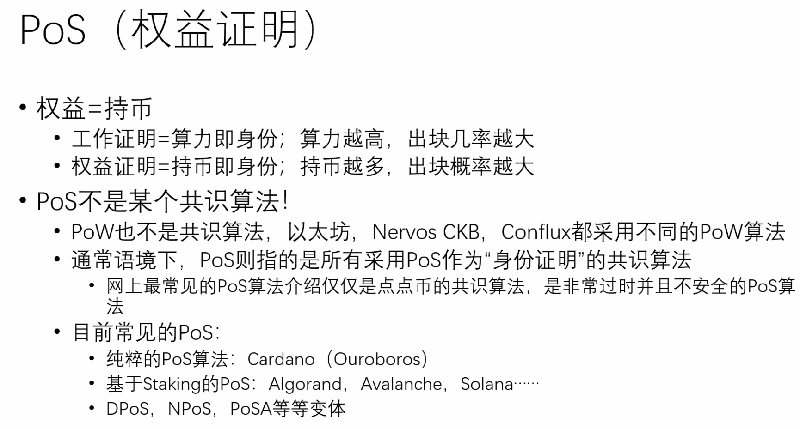

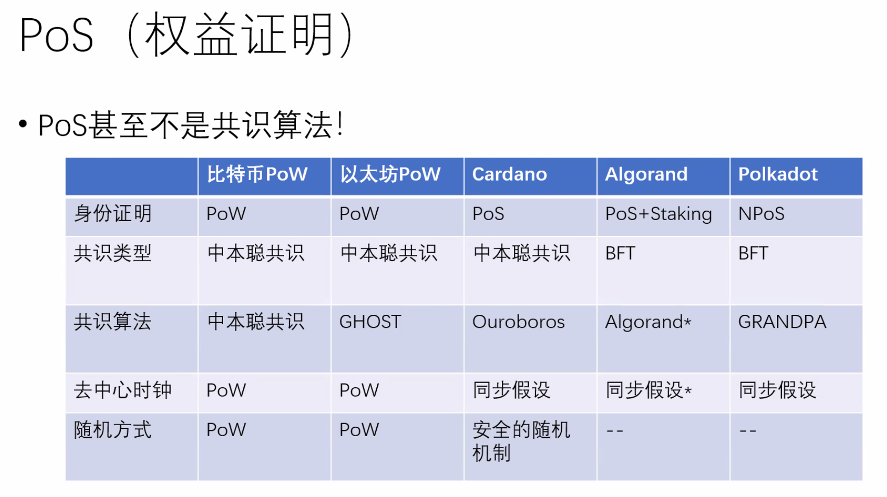

### 扩容

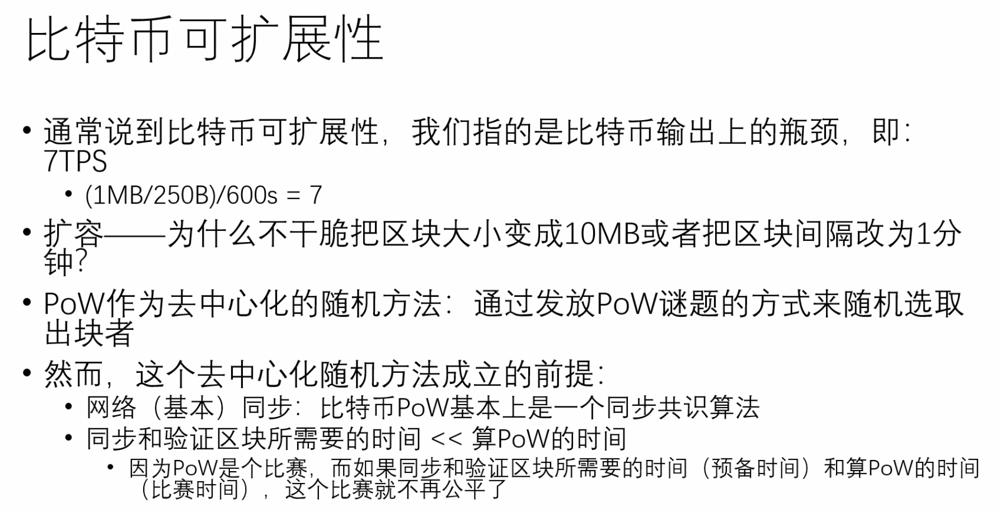

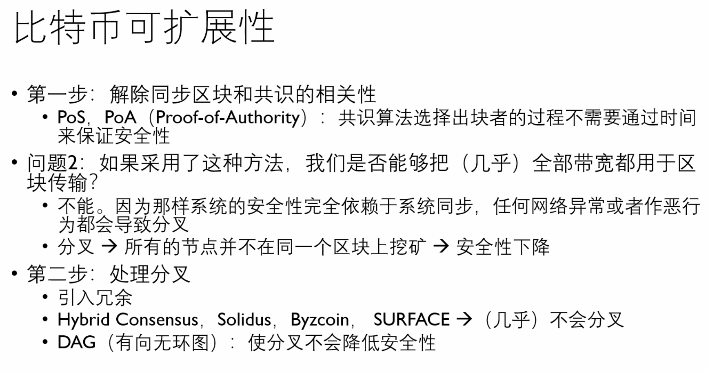

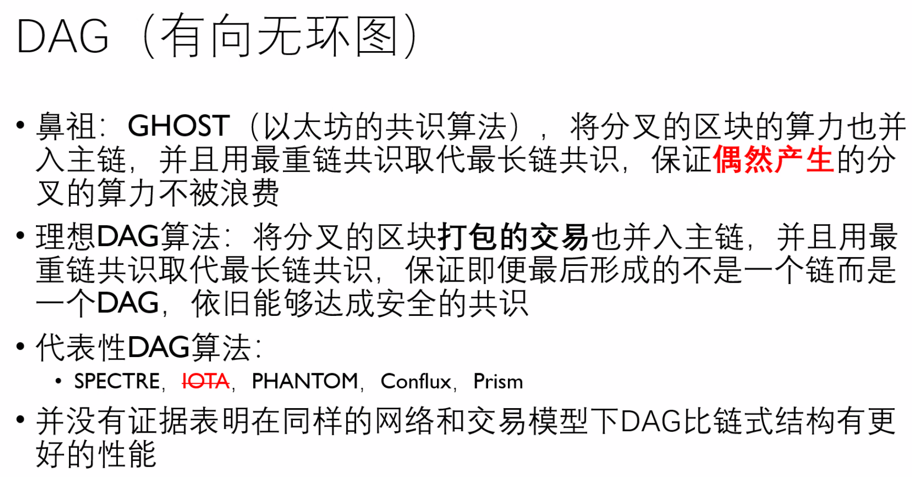

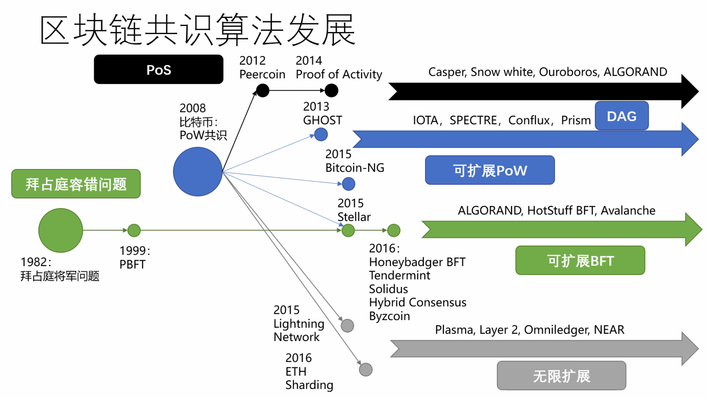

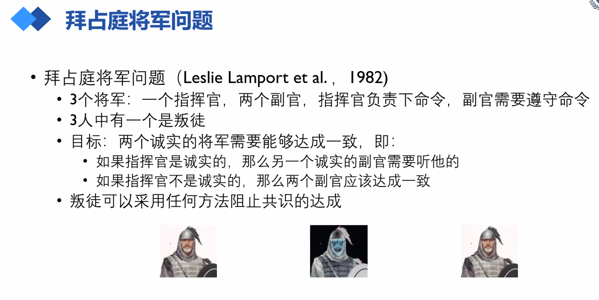

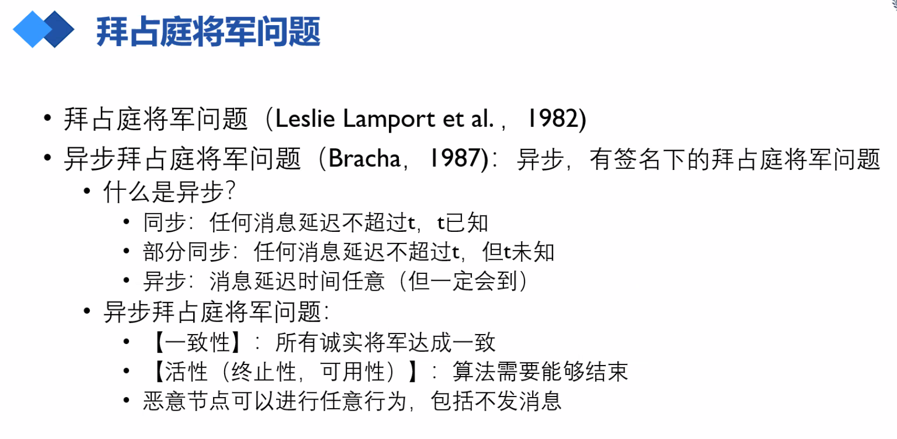

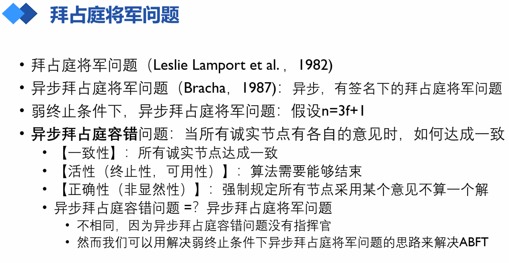

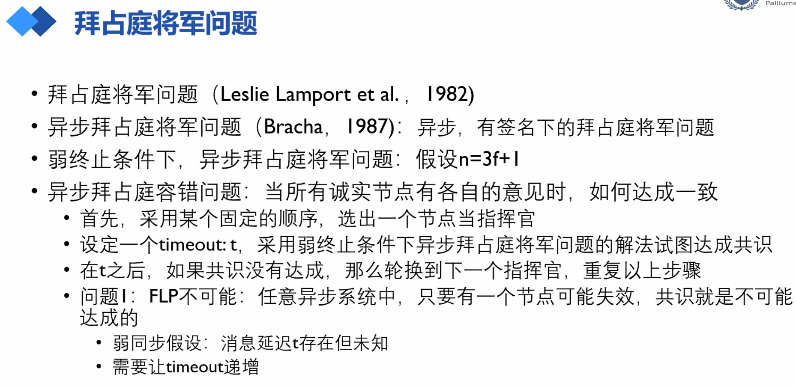

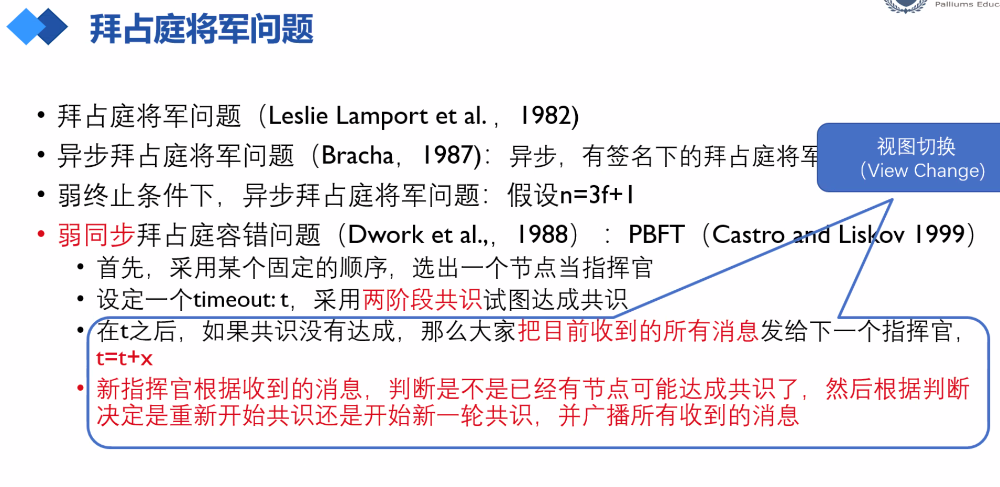

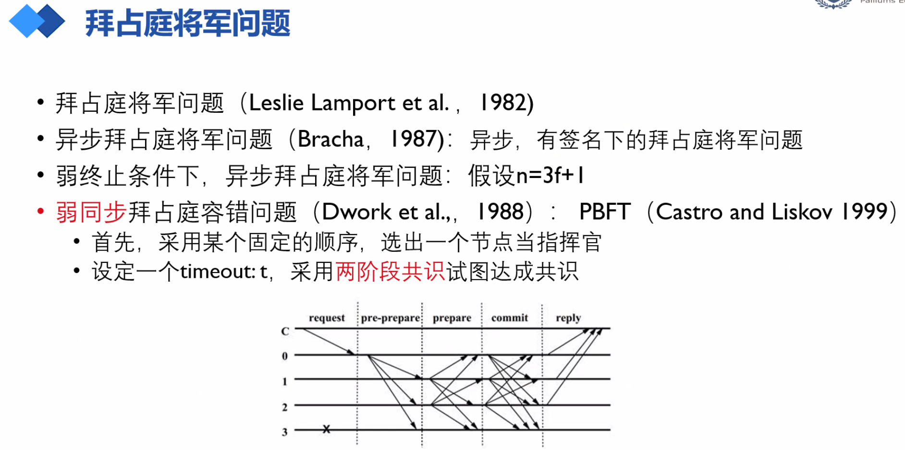

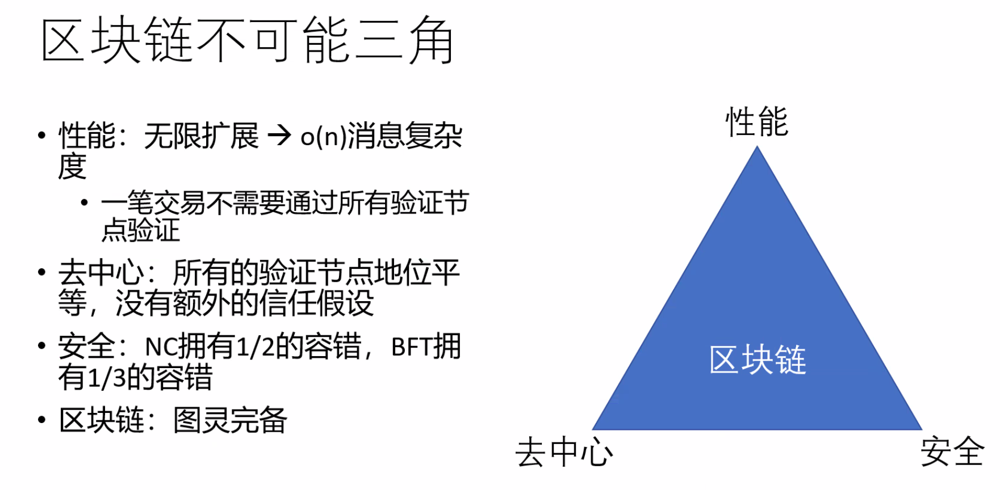

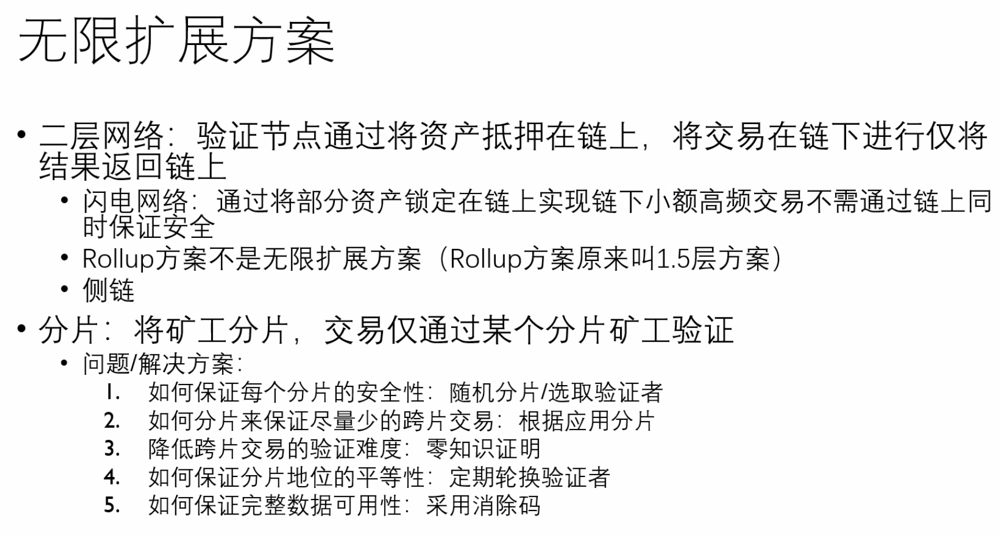

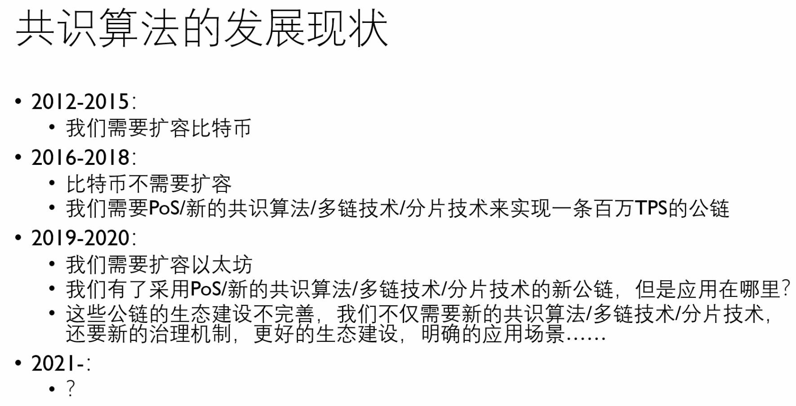

## 联盟链

### 超级账本

### 联盟生态链

## 公链生态

### 早期合约

### DeFi

### DAO
